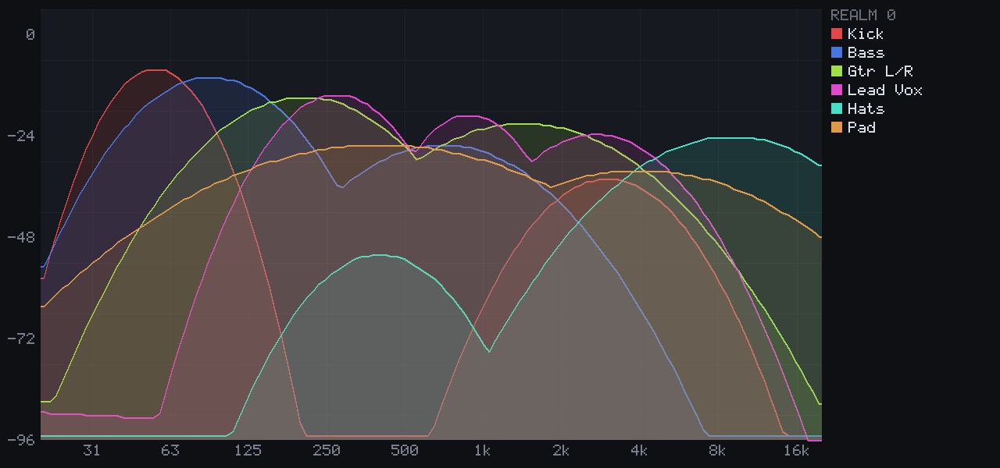

# Bedrock — multi-track spectrum analyzer (VST3)

A functional clone of [Crickets Audio Strata](https://www.cricketsaudio.com/products_strata):
see every track in a session layered into one frequency graph, so masking, mud and spectral
imbalance are visible at a glance instead of inferred by soloing.

It ships as **two plugins in one VST3 bundle**:

| Plugin | Where it goes | What it does |
| --- | --- | --- |
| **Bedrock Track** | every channel you want to see | Passes audio through untouched, analyses it, publishes a spectrum |
| **Bedrock Vision** | one track of its own | Collects every Track and draws them layered into a single graph |



*Six tracks of a synthetic mix. Each curve is one channel; the legend names them.*

## Why it is two plugins and a socket

A mix analyzer has to see audio that lives in many places at once. Track and Vision are separate
plugin instances that a host is free to run in separate sandboxed processes, and there may be
dozens of Tracks to one Vision — so they talk over **loopback TCP**. That crosses every process
boundary a host can put between them, needs no agreed-on file path, and cleans itself up on its
own: a closed socket *is* the "this track is gone" signal.

A **realm** is simply a port offset. Vision for realm *r* listens on `49900 + r`; Tracks set to
realm *r* dial it. Two projects open at once pick different realms and cannot see each other's
tracks. Because the realm decides the port, a second Vision on the same realm fails to bind —
which is exactly the error the user needs to see, and it is shown in the graph area rather than
swallowed.

## Build

Needs a Rust toolchain. Nothing else — no VST3 SDK download, no CMake, no JUCE. The
[`vst3`](https://crates.io/crates/vst3) crate provides pre-generated bindings, and the window
backends call the platform APIs directly.

```bash
cd vst3
./scripts/bundle.sh --install     # build release, lay out the .vst3, install for the current user
./scripts/bundle.sh --debug       # build only, leave it in ./out
```

Installs to `~/Library/Audio/Plug-Ins/VST3` (macOS), `~/.vst3` (Linux), or
`%PROGRAMFILES%\Common Files\VST3` (Windows). Rescan in your host; both plugins appear under
**Fx | Analyzer**.

On macOS the script builds both architectures when the targets are installed and `lipo`s them
together, then ad-hoc signs the bundle — recent macOS refuses to load an unsigned one.

## Using it

1. Put **Bedrock Track** at the end of the plugin chain on each channel you want to see.
2. Put **Bedrock Vision** on any one track and open its editor.
3. Leave everything on realm 0 unless you have two projects open at once.

Track's parameters: **Realm**, **Slot** (display order), **Send** (analysis on/off).
Vision's: **Realm**, **Palette**, **Fill**, **Legend**, **Grid**.

Track names and colours come from the host through the VST3 channel-context API, which is what
makes the **DAW Colors** palette show your session's own colours. Hosts that don't report them
fall back to generated colours, and every track still gets a distinct one.

The window is freely resizable and the layout is resolution-independent — spacing, line widths
and font sizes all scale, and the legend is dropped rather than squeezed once the graph would
lose too much width.

## Layout

```
bedrock-core/            Everything that isn't VST3 or windowing. No platform dependencies.
  analyzer.rs            Windowed rFFT, log-spaced display bins, dBFS, ballistics
  protocol.rs            Binary wire format, incremental decoder
  hub.rs                 TCP listener (Vision), reconnecting client (Track), lock-free queue
  registry.rs            Live track table, ordering, stale eviction
  render.rs              Software rasteriser for the graph
  palette.rs             Colour schemes and DAW-colour import
  font.rs                Embedded 5x7 bitmap font
  examples/preview.rs    Renders the graph to PNG without a DAW

bedrock-vst3/            The plugin module (one cdylib, two plugin classes).
  lib.rs                 Factory and module entry points
  boilerplate.rs         impl_plugin!, the VST3 surface both plugins share
  track.rs               Bedrock Track
  vision.rs              Bedrock Vision
  view.rs                IPlugView, repaint timing
  platform/              x11.rs, macos.rs, win32.rs — get a pixel buffer into the host's window
  tests/host_harness.rs  Loads the built binary and drives it like a host
```

## Design notes

**Analysis is mono, 4096-point, hopped every 1024 samples.** A spectrum per channel would double
the wire traffic and halve the legibility of the graph for no real gain in a balance tool.

**Display bins near the bottom of the range interpolate rather than share an FFT bin.** Below a
few hundred hertz a log-spaced display bin is narrower than the FFT's resolution, so neighbouring
bins would read the identical FFT bin — drawing the low end as a staircase and putting a tone's
apparent peak on whichever end of the plateau you scanned last. Above that, each display bin
takes the loudest FFT bin it covers, which is what keeps narrow peaks visible.

**Magnitudes are quantised to one byte on the wire.** Across the 120 dB display range that is
0.47 dB per step — finer than a pixel on any window you'd open — and it cuts a frame to 137
bytes. A 32-track session costs about 200 KB/s over loopback.

**The audio thread never blocks and never allocates.** Frames go to the sender thread through a
lock-free single-producer queue that drops when full rather than waiting; a spectrum frame that
arrives late is worthless anyway.

**Repaints run on the host's run loop on Linux.** The VST3 Linux specification forbids a plugin
from starting its own event loop or timer, so the view registers an `ITimerHandler` with the
`IRunLoop` it gets from `IPlugFrame`. macOS uses a `CFRunLoopTimer` and Windows a `SetTimer`.

**Both plugins are single-component effects** — one object implements `IComponent`,
`IAudioProcessor` and `IEditController` together rather than the split processor/controller
pair. The analyser, the network link, the host-reported channel name and the view all need the
same state, so keeping them in one object removes a layer of message passing that would exist
only to reunite them.

## Tests

```bash
cargo test --workspace                              # 118 tests
cargo run -p bedrock-core --example preview -- out  # render the graph to PNG
cargo check -p bedrock-vst3 --features typecheck-all
```

`tests/host_harness.rs` is the interesting one: it `dlopen`s the built binary, pulls
`GetPluginFactory` out of it, and drives the real COM vtables the way a DAW does — enumerate
classes, instantiate, negotiate bus arrangements, activate, push audio, save and restore state.
The end-to-end case runs a 1 kHz tone through a Track instance and asserts the spectrum arriving
at a hub peaks at 1 kHz.

`--features typecheck-all` compiles the non-native window backends so they can be type-checked
from any host (Rust type-checks unreachable code, so this catches real errors in the FFI).

## Status

Verified on Linux: the full suite runs, the bundle builds, and the harness drives the shipped
binary. The **macOS and Windows window backends compile and type-check but have not been run in
a DAW** — everything below the window (analysis, transport, rendering, the VST3 surface) is
platform-independent and covered by tests. If a backend fails to create its surface the view
refuses to attach and the host falls back to its own generic parameter editor, so a problem
there degrades rather than breaks.

## Naming and licence

Named Bedrock rather than Strata: this is an independent implementation of a published idea, not
a copy of Crickets Audio's product, and it carries none of their code, branding or assets. If
you want a different name, `PRODUCT` in `bundle.sh` and the two strings in `lib.rs`'s `CLASSES`
are the whole of it — though the class UIDs should change too if you redistribute.

GPL-3.0, matching the rest of this repository.
